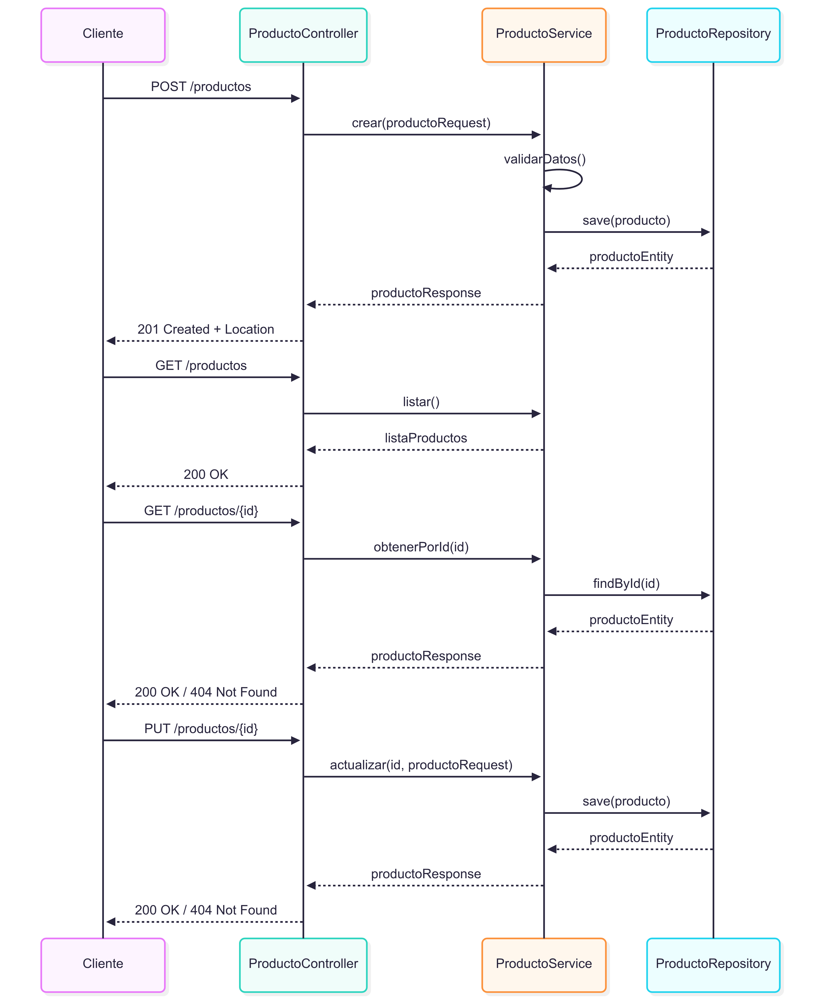
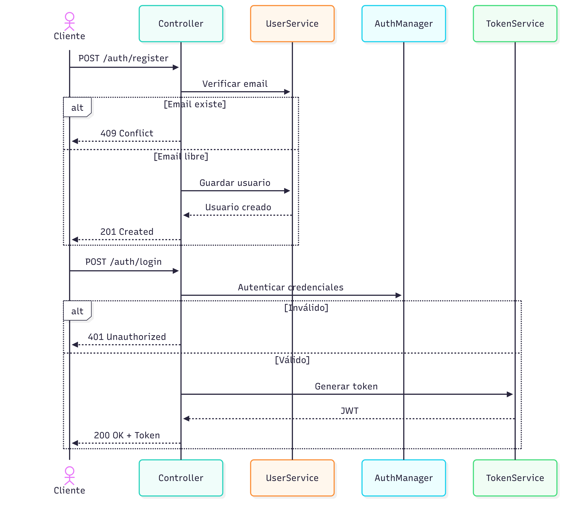

# Stocker Backend


## Instalación

Para instalar y ejecutar el proyecto en tu máquina local, sigue estos pasos:

1. **Clona el repositorio**:

    ```bash
    git clone https://github.com/martin-amaro/pi_backend2.git
    ```

2. **Accede a la carpeta del proyecto**:
    ```bash
    cd pi_backend2
    ```

3. **Genera el archivo de variables de entorno `.env`**:

    ```bash
    cp .env.example .env
    ```

4. **Configura las credenciales de la base de datos en Postgres en el archivo `.env`**:

    ```bash
    DB_PASSWORD=
    DB_USERNAME=
    DB_URL=
    ```

    Puedes obtener credenciales gratuitas en [Supabase](https://supabase.com/).

5. **Inicia el proyecto**:

    Abre y ejecuta `Pib2Application.java`. Luego accede a [localhost:8080](http://localhost:8080/) desde cualquier navegador.

---

# Proyecto: Gestión de Productos

## Fase 1 – Análisis de Negocio

### Recurso principal
**Producto**

#### Negocio:
| Atributo | Tipo | Descripción |
|---|---|---|
| `id` | UUID | Identificador único del negocio |
| `nombre` | String | Nombre del negocio |
| `direccion` | String | Dirección de la empresa |

#### Usuario:
| Atributo | Tipo | Descripción |
|---|---|---|
| `id` | UUID | Identificador único del usuario |
| `nombre` | String | Nombre del usuario |
| `email` | String | Correo electrónico, usado para login |
| `password` | String | Contraseña cifrada del usuario |
| `rolId`| UUID | ID del rol de usuario (ej. `ADMIN`, `EMPLOYEE`) |
| `businessId`| UUID | ID del negocio al que pertenece |

#### Rol:
| Atributo | Tipo | Descripción |
|---|---|---|
| `id` | UUID | Identificador único del rol |
| `nombre`| Enum | Nombre del rol (ej. `ADMIN`, `EMPLOYEE`) |

#### Categoría:
| Atributo | Tipo | Descripción |
|---|---|---|
| `id` | UUID | Identificador único de la categoría |
| `nombre` | String | Nombre de la categoría |
| `descripcion` | String | Descripción de la categoría |

#### Proveedor:
| Atributo | Tipo | Descripción |
|---|---|---|
| `id` | UUID | Identificador único del proveedor |
| `nombre` | String | Nombre del proveedor |
| `email` | String | Correo electrónico de contacto |
| `telefono` | String | Teléfono de contacto |
| `direccion` | String | Dirección del proveedor |

#### Producto:      
| Atributo | Tipo | Descripción |
|---|---|---|
| `id` | UUID | Identificador único del producto |
| `nombre` | String | Nombre del producto |
| `descripcion` | String | Descripción detallada |
| `precio` | Double | Precio de venta del producto |
| `stock` | Integer | Cantidad disponible en inventario |
| `categoriaId` | UUID | ID de la categoría a la que pertenece |
| `businessId` | UUID | ID del negocio al que pertenece |
| `proveedorId` | UUID | ID del proveedor del producto |
| `activo` | Boolean | Indica si el producto está visible |

#### Orden:
| Atributo | Tipo | Descripción |
|---|---|---|
| `id` | UUID | Identificador único de la orden |
| `fecha` | Date | Fecha y hora de la orden |
| `estado` | Enum | Estado de la orden (ej. `PENDING`, `COMPLETED`, `CANCELED`) |
| `total` | Double | Total de la orden |
| `userId` | UUID | ID del usuario que realizó la orden |
| `businessId` | UUID | ID del negocio que gestiona la orden |

#### Detalle de Orden:
| Atributo | Tipo | Descripción |
|---|---|---|
| `id` | UUID | Identificador único del detalle |
| `ordenId` | UUID | ID de la orden a la que pertenece |
| `productoId` | UUID | ID del producto en la orden |
| `cantidad` | Integer | Cantidad del producto comprado |
| `precioUnitario`| Double | Precio del producto al momento de la compra |

#### Movimiento de Stock:
| Atributo | Tipo | Descripción |
|---|---|---|
| `id` | UUID | Identificador único del movimiento |
| `fecha` | Date | Fecha del movimiento |
| `tipo` | Enum | Tipo de movimiento (ej. `INBOUND`, `OUTBOUND`, `ADJUSTMENT`) |
| `cantidad`| Integer | Cantidad de stock añadida o retirada |
| `productoId`| UUID | ID del producto afectado |
| `userId` | UUID | Usuario que realizó el movimiento |
| `descripcion`| String | Razón del movimiento |

### Relaciones
- Un **Negocio** tiene muchos **Productos**, **Usuarios** y **Órdenes**.
- Un **Usuario** pertenece a un solo **Negocio**, y tiene un **Rol**.
- Un **Producto** pertenece a un **Negocio**, una **Categoría** y un **Proveedor**, y tiene muchos **Movimientos de Stock**.
- Una **Orden** pertenece a un **Usuario** y un **Negocio**, y tiene muchos **Detalles de Orden**.
- Un **Detalle de Orden** pertenece a una **Orden** y a un **Producto**.
- Un **Movimiento de Stock** pertenece a un **Producto** y a un **Usuario**.

---

## Fase 2 – Diseño MVC

### Capas y responsabilidades

| Capa        | Responsabilidad                  | Elemento diseñado |
|-------------|----------------------------------|-------------------|
| **Modelo**  | Persistencia + reglas de negocio | Entidad: `Producto`<br>Regla: "No permitir stock negativo" |
| **Vista**   | Representación JSON              | DTO: `ProductoRequest`, `ProductoResponse` |
| **Controlador** | Definir y manejar endpoints  | Clase: `ProductoController` |

---

# Endpoints
### Productos

| Endpoint           | Método | Descripción                | Código Éxito     | Código Error |
|--------------------|--------|----------------------------|------------------|--------------|
| `/productos`       | GET    | Listar todos los productos | `200 OK`         | -            |
| `/productos`       | POST   | Crear nuevo producto       | `201 Created + Location` | `400 Bad Request` |
| `/productos/{id}`  | GET    | Obtener producto por ID    | `200 OK`         | `404 Not Found` |
| `/productos/{id}`  | PUT    | Actualizar producto        | `200 OK`         | `404 Not Found` |

### Autenticación

| Endpoint         | Método | Descripción                    | Código Éxito                   | Código Error                                                               |
| ---------------- | ------ | ------------------------------ | ------------------------------ | -------------------------------------------------------------------------- |
| `/auth/register` | POST   | Registrar un nuevo usuario     | `201 Created` (usuario creado) | `409 Conflict` (correo ya existe)                                          |
| `/auth/login`    | POST   | Iniciar sesión (obtener token) | `200 OK` (JWT Token)           | `401 Unauthorized` (credenciales inválidas)<br>`500 Internal Server Error` |

### Reglas de negocio
1. Un producto no puede tener un stock negativo.
2. El nombre del producto debe ser único dentro de la categoría.
3. Si un producto está inactivo (`activo: false`), no puede aparecer en listados públicos.

---

## Fase 3 – Diagramas

### 📊 Diagrama de Secuencia – Productos
El diagrama muestra el flujo de interacción entre el cliente y los componentes de la API para la gestión de productos.



### 🔑 Diagrama de Secuencia – Autenticación
El diagrama muestra el flujo de autenticación en la API. Incluye el registro de usuarios, validando si el correo ya existe, y el inicio de sesión, donde se autentican las credenciales y, en caso válido, se genera un token JWT para el cliente.



---

## Mock de Respuesta JSON

```json
{
  "id": 1,
  "nombre": "Producto Ejemplo",
  "descripcion": "Descripción del producto",
  "precio": 100.0,
  "stock": 50,
  "categoriaId": 2,
  "activo": true
}
```
# 📦 API de Productos

Este proyecto gestiona productos con operaciones de creación, lectura y actualización, siguiendo una arquitectura MVC.

---

## 📑 Endpoints

| Endpoint           | Método | Descripción                | Código Éxito               | Código Error     |
|--------------------|--------|----------------------------|-----------------------------|------------------|
| `/productos`       | GET    | Listar todos los productos | `200 OK`                    | -                |
| `/productos`       | POST   | Crear nuevo producto       | `201 Created + Location`    | `400 Bad Request`|
| `/productos/{id}`  | GET    | Obtener producto por ID    | `200 OK`                    | `404 Not Found`  |
| `/productos/{id}`  | PUT    | Actualizar producto        | `200 OK`                    | `404 Not Found`  |

---

## 📊 Diagrama de flujo de Endpoints

.png)
